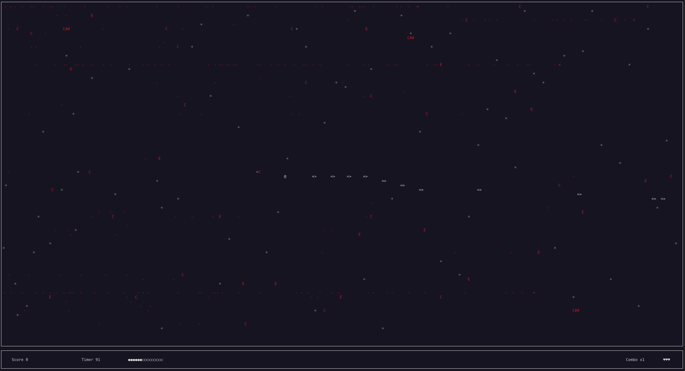

# **Galactic Pew Pew**

```plaintext
             _            _   _                                                  
  __ _  __ _| | __ _  ___| |_(_) ___   _ __   _____      __  _ __   _____      __
 / _` |/ _` | |/ _` |/ __| __| |/ __| | '_ \ / _ \ \ /\ / / | '_ \ / _ \ \ /\ / /
| (_| | (_| | | (_| | (__| |_| | (__  | |_) |  __/\ V  V /  | |_) |  __/\ V  V / 
 \__, |\__,_|_|\__,_|\___|\__|_|\___| | .__/ \___| \_/\_/   | .__/ \___| \_/\_/  
 |___/                                |_|                   |_|                  
```
Galactic Pew Pew is a retro-inspired text-based shooting game built using the **ncurses** library. Take on the role of a brave pilot defending the galaxy from waves of interstellar enemies.

---

## **Features**

- **Clock based**: The game is based on a clock so the actions are not necessarly based on frame.  
- **Linked lists**: Enemies and projectiles are managed with linked lists for efficient memory managment.  
- **Progressive difficulty**: Enemy speed and spawn rates increase as time passes.  
- **Simple interface**: A clean display with real-time score and statistics in an info bar.  
- **Customizable gameplay mechanics**: Easily tweak game parameters like enemy speed, spawn intervals, or even adding new mobs.
- **Cool menu**: Chose you character before starting the game and check for the enemies in the bestiary.

---

## **Installation**

1. Clone this repository to your local machine:  

   ```bash
   git clone https://github.com/username/galactic-pew-pew.git
   cd galactic-pew-pew
   ```

2. Install required dependencies:  

   You need the c compiler `cc`
   You need the `ncurses` library installed

---

## **Compilation**

To build the game, use the provided `Makefile`:  

```bash
make
```

To clean up generated object files and binaries:  

```bash
make clean
```

---

## **Controls**

- **Arrow keys**: Move your ship.  
- **Spacebar**: Shoot projectiles.  
- **q**: Quit the game.  

---

## **Credits**

- [Liammmmmmmm](https://github.com/Liammmmmmmm)
- [rayseur123](https://github.com/rayseur123)

---

## **Screenshot**

  
